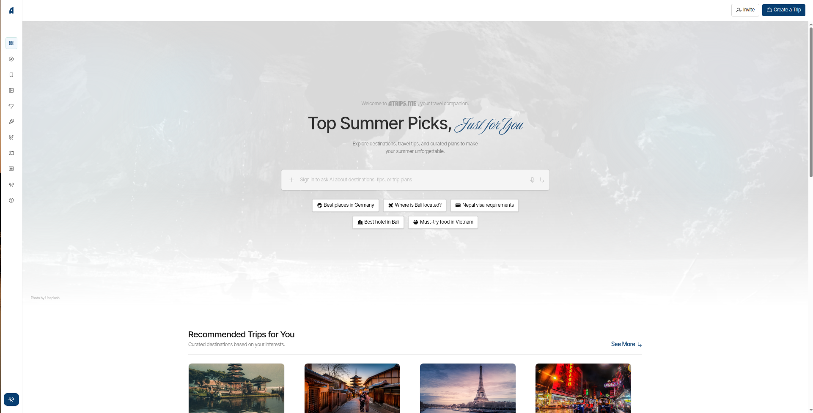
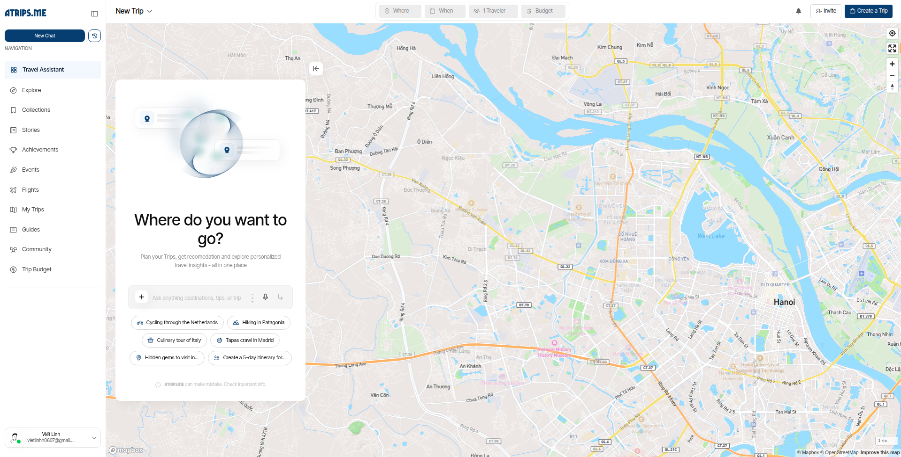
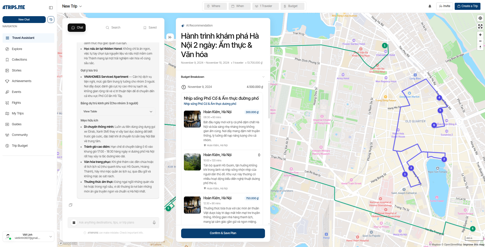
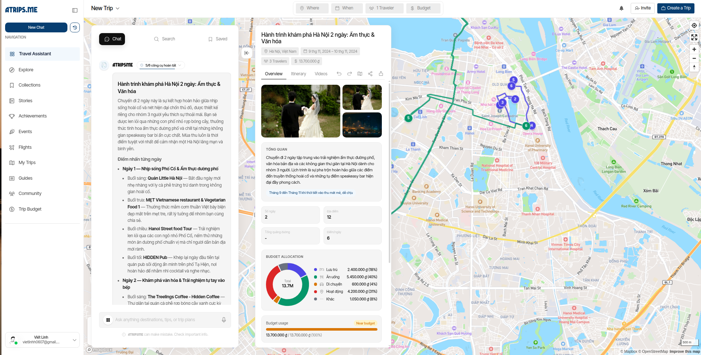
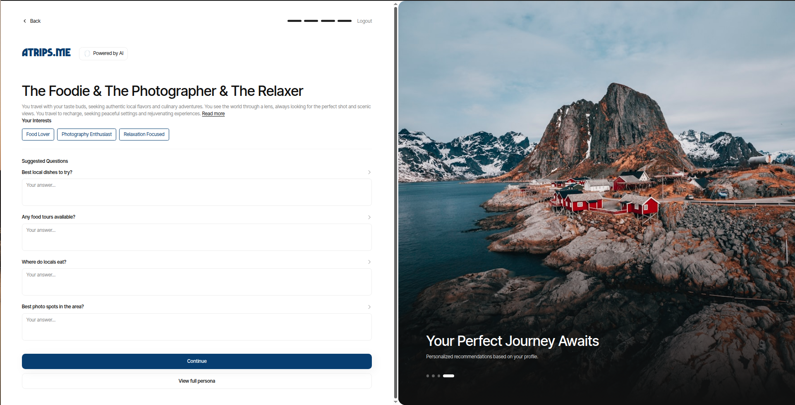
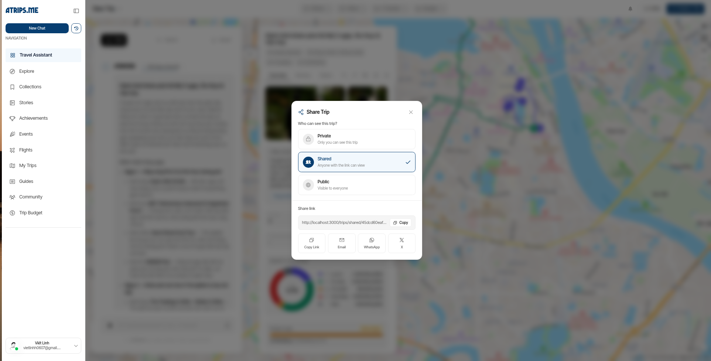
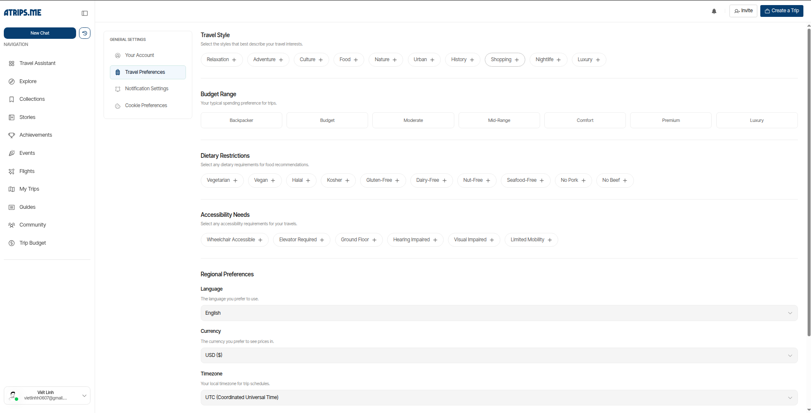

<p align="center">
  
</p>

<p align="center">
  The open-source AI travel planning platform.
  <br />
  Plan trips through conversation. Collaborate in real-time. Share with anyone.
</p>

<p align="center">
  <a href="https://github.com/vietlinhh02/atrips.com/stargazers"></a>
  <a href="https://github.com/vietlinhh02/atrips.com/blob/main/LICENSE"></a>
  <a href="https://github.com/vietlinhh02/atrips.com/pulse"></a>
  <a href="https://github.com/vietlinhh02/atrips.com/issues"></a>
</p>

<p align="center">
  <a href="#screenshots"><b>Screenshots</b></a> ·
  <a href="#features"><b>Features</b></a> ·
  <a href="#tech-stack"><b>Tech Stack</b></a> ·
  <a href="#getting-started"><b>Getting Started</b></a> ·
  <a href="#contributing"><b>Contributing</b></a>
</p>

<br />

<p align="center">
  <a href="https://github.com/vietlinhh02/atrips.com">
    
  </a>
</p>

## About

atrip.me is a full-stack travel planning platform where you chat with AI to build complete trip itineraries — flights, hotels, restaurants, activities — all visualized on interactive maps. Plan solo or collaborate with friends in real-time, then share your trips with a single link.

## Screenshots

<p align="center">
  
  &nbsp;
  
</p>

<p align="center">
  
  &nbsp;
  
</p>

<p align="center">
  
  &nbsp;
  
</p>

<p align="center">
  
  &nbsp;
  
</p>

## Features

**AI Trip Planning** — Describe your ideal trip in natural language. AI builds a full itinerary with scheduling, budgets, and alternatives. Supports OpenAI, Gemini, and Claude.

**Itinerary Builder** — Day-by-day timeline with inline editing, drag-and-drop reordering, and activity voting for group decisions. Integrates flights and accommodations directly.

**Place Enrichment** — Every destination is auto-enriched with photos, reviews, pricing, and opening hours from multiple data sources.

**Interactive Maps** — Visualize your entire trip on Mapbox-powered maps. See routes, distances, and nearby points of interest at a glance.

**Real-time Collaboration** — Invite friends to plan together. See changes instantly. Vote on activities to reach group consensus.

**Smart Budgeting** — Track expenses across categories with multi-currency support. Set budgets per day or per trip.

**Social Platform** — Share trips via public links, write travel stories, follow other travelers, collect favorite itineraries, and earn achievements.

## Tech Stack

**Frontend** — [Next.js 16](https://nextjs.org/) · [React 19](https://react.dev/) · [TypeScript](https://www.typescriptlang.org/) · [Tailwind CSS 4](https://tailwindcss.com/) · [Radix UI](https://www.radix-ui.com/) · [Zustand](https://zustand.docs.pmnd.rs/) · [Mapbox GL](https://www.mapbox.com/) · [Framer Motion](https://motion.dev/)

**Backend** — [Express.js 5](https://expressjs.com/) · [Prisma 6](https://www.prisma.io/) · [PostgreSQL 16](https://www.postgresql.org/) + PostGIS · [Redis 7](https://redis.io/) · [BullMQ](https://bullmq.io/) · [LangChain](https://js.langchain.com/)

**Infrastructure** — [Docker](https://www.docker.com/) · [AWS S3](https://aws.amazon.com/s3/) · [Novu](https://novu.co/) · [Stripe](https://stripe.com/) · [SearXNG](https://docs.searxng.org/)

## Architecture

```
.                          ← Express.js API (backend at root)
├── src/modules/           ← 17 feature modules (clean architecture)
│   ├── ai/                   AI planning & chat
│   ├── trip/                 Trip management & sharing
│   ├── place/                Place enrichment pipeline
│   ├── flight/               Flight search (Amadeus)
│   ├── expense/              Budget tracking
│   └── ...                   auth, chat, explore, weather, etc.
├── prisma/                ← Database schema (30+ models)
├── frontend/              ← Next.js client (subdirectory)
│   └── src/
│       ├── app/              App Router pages
│       ├── components/       UI components
│       ├── stores/           Zustand state
│       └── services/         API layer
└── docs/                  ← Documentation & screenshots
```

Each backend module follows a layered pattern: `application/` → `domain/` → `infrastructure/` → `interfaces/http/`

## Getting Started

### Prerequisites

- [Node.js 22 LTS](https://nodejs.org/)
- [Docker](https://www.docker.com/)
- [pnpm](https://pnpm.io/) (for frontend)

### Setup

```bash
# Clone
git clone https://github.com/vietlinhh02/atrips.com.git
cd atrips.com

# Start PostgreSQL, Redis, SearXNG
docker compose up -d

# Backend (runs from project root)
cp .env.example .env          # configure your API keys
npm install
npx prisma generate
npx prisma migrate dev
npm run dev

# Frontend (in a second terminal)
cd frontend
cp .env.example .env.local    # configure frontend vars
pnpm install
pnpm dev
```

See [`.env.example`](.env.example) for all required environment variables.

## Contributing

We welcome contributions! See the [Contributing Guide](CONTRIBUTING.md) for details.

1. Fork the repo
2. Create your branch (`git checkout -b feat/your-feature`)
3. Commit changes (`git commit -m 'feat: add your feature'`)
4. Push (`git push origin feat/your-feature`)
5. Open a Pull Request

## License

Licensed under [Apache 2.0](LICENSE).

---

<p align="center">
  <sub>Built by <a href="https://github.com/vietlinhh02">vietlinhh02</a></sub>
</p>
